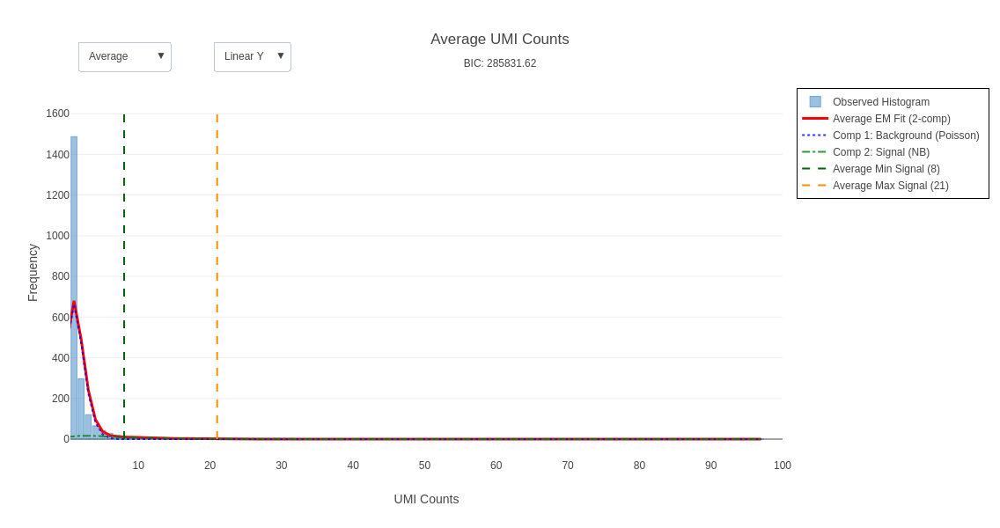
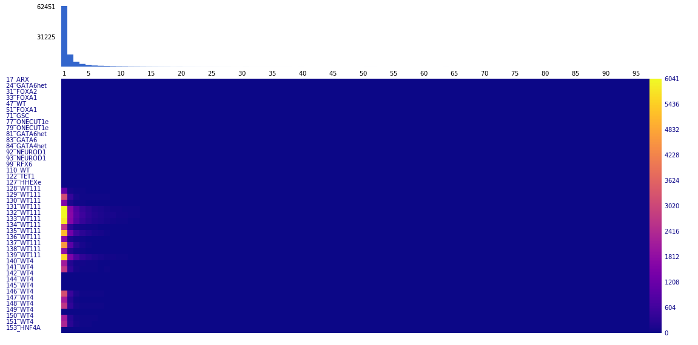
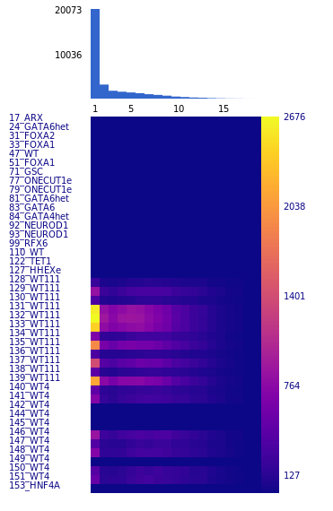

## Introduction

`assignBarcodes` is a fast, parallelized utility designed for targeted sequencing analysis in single-cell experiments. It efficiently assigns feature barcodes from FASTQ files to a known set of sequence barcodes, serving as a powerful, open-source alternative to proprietary tools.

Key features include:
- **Exhaustive Search:** Unlike other tools, `assignBarcodes` can perform an exhaustive search, enabling it to identify feature barcodes in both ATAC-seq and RNA-seq data, significantly increasing coverage in targeted sequencing.
- **Advanced Error Correction:** Implements customizable error correction for sequence barcodes, handling substitutions and indels, inspired by methodologies used in tools like CellRanger.
- **Fuzzy Matching:** Provides fuzzy matching capabilities for feature sequences to account for sequencing errors.
- **UMI Deduplication:** Correctly handles UMI-based deduplication with strategies tailored for different sequencing assays (e.g., targeted vs. whole-transcriptome). It intelligently handles UMI sequencing errors by identifying and collapsing connected cliques of similar UMIs.
- **High Performance:** Achieves high processing speeds (e.g., ~1 million reads/second on a standard laptop for targeted sequencing) through multi-level parallelization.

## Quick start
### Installation

On Ubuntu/Debian:
```bash
sudo apt-get update
sudo apt-get -y install build-essential zlib1g-dev libcairo2-dev
cd process_features
make
sudo cp assignBarcodes /usr/local/bin
```
If heatmap generation is not required, you can omit the `libcairo2-dev` dependency and compile using:
```bash
make NO_HEATMAP=1
```

#### Docker
Alternatively, you can use the Docker container `biodepot/process_features:latest` or build it from the provided Dockerfile.

## Usage

```bash
assignBarcodes [options] [directory1 directory2 ...]
```

The tool can accept input FASTQ files in two ways:
1.  **By directory:** Positional arguments specifying directories containing FASTQ files. The tool will search for files matching the patterns for barcode, forward, and reverse reads.
2.  **By file list:** Using `--barcode_fastqs`, `--forward_fastqs`, and `--reverse_fastqs` to provide comma-separated lists of files.

## Flags and Descriptions

### Input & Output Files

| Flag | Argument | Description | Default |
| :--- | :--- | :--- | :--- |
| `-w`, `--whitelist` | `[filename]` | Whitelist file for sequence barcodes. | (required) |
| `-f`, `--featurelist` | `[filename]` | Feature list file (CSV with 'name' and 'sequence' columns). | (required) |
| `-d`, `--directory` | `[path]` | Base output directory. A subdirectory will be created for each sample. | (required) |
| `--filtered_barcodes` | `[filename]` | A file containing a list of barcodes to process, one per line. If provided, only these barcodes will be processed. | |
| `--min_heatmap` | `[int]` | Minimum deduped count for a feature to be included in the Feature Counts Heatmap. | 0 |
| `--barcode_fastqs` | `[string]` | Comma-separated list of barcode FASTQ files. | |
| `--forward_fastqs` | `[string]` | Comma-separated list of forward read FASTQ files. | |
| `--reverse_fastqs` | `[string]` | Comma-separated list of reverse read FASTQ files. | |
| `--barcode_fastq_pattern` | `[string]` | Pattern to identify barcode FASTQ files in directories. | `_R1_` |
| `--forward_fastq_pattern` | `[string]` | Pattern to identify forward read FASTQ files. | `_R2_` |
| `--reverse_fastq_pattern` | `[string]` | Pattern to identify reverse read FASTQ files. | `_R3_` |
| `-k`, `--keep_existing` | | If output files exist, skip processing for that sample. | `false` |

### Barcode & Feature Processing

| Flag | Argument | Description | Default |
| :--- | :--- | :--- | :--- |
| `-b`, `--barcode_length`| `[int]` | Length of the sequence barcode. | `16` |
| `-u`, `--umi_length` | `[int]` | Length of the Unique Molecular Identifier (UMI). | `12` |
| `-o`, `--feature_constant_offset`| `[int]` | Expected starting position of the feature sequence in the read. Used for an initial directed search. | `0` |
| `-B`, `--barcode_constant_offset`| `[int]` | Starting position of the barcode and UMI in the read. | `0` |
| `--limit_search` | `[int]` | Limit the search for the feature sequence to `N` bases around `feature_constant_offset`. Set to `-1` to search the entire read. | `-1` |
| `-r`, `--reverse_complement_whitelist` | | Reverse complement the whitelist barcodes before use. | `false` |
| `-a`, `--as_named` | | Treat all input files as part of a single sample. | `false` |

### Error Correction & Thresholds

| Flag | Argument | Description | Default |
| :--- | :--- | :--- | :--- |
| `-m`, `--maxHammingDistance` | `[int]` | Maximum Hamming distance for a feature sequence to be considered a match (inclusive). | `1` |
| `-s`, `--stringency` | `[int]` | Stringency for UMI deduplication. See [UMI de-duplication](#umi-de-duplication) section for details. | `1` |
| `-i`, `--min_counts` | `[int]` | Minimum read count for a UMI clique to be considered for counting. | `1` |
| `-M`, `--min_posterior` | `[float]` | Minimum posterior probability to rescue a barcode with sequencing errors. | `0.975` |
| `--max_barcode_mismatches` | `[int]` | Maximum number of mismatches allowed to rescue a sequence barcode. | `3` |
| `--feature_n` | `[int]` | Maximum number of 'N' bases allowed in a feature sequence. | `3` |
| `--barcode_n` | `[int]` | Maximum number of 'N' bases allowed in a sequence barcode. | `1` |
| `--max_reads` | `[long]` | Maximum number of reads to process from each FASTQ file. | `0` (all) |
| `--min_prediction` | `[int]` | Minimum prediction threshold for feature assignment (advanced, rarely needed). | `1` |

### EM Fitting (Removed)

*The EM fitting functionality has been removed from this version. Feature assignment now uses direct counting only.*

### Performance & Parallelism

| Flag | Argument | Description | Default |
| :--- | :--- | :--- | :--- |
| `-t`, `--threads` | `[int]` | Maximum number of concurrent processes (samples to process in parallel). | `8` |
| `-S`, `--search_threads` | `[int]` | Manually set the number of threads for the feature search step (per consumer thread). Overrides automatic allocation. | `4` |
| `-c`, `--consumer_threads_per_set`| `[int]` | Manually set the number of consumer threads per sample. Overrides automatic allocation. | `1` |
| `-R`, `--read_buffer_lines` | `[int]` | Number of lines for the read buffer. | `1024` |
| `-L`, `--average_read_length` | `[int]` | Estimated average read length for buffer allocation. | `300` |

### Miscellaneous

| Flag | Argument | Description | Default |
| :--- | :--- | :--- | :--- |
| `-v`, `--debug` | | Enable verbose debug output. | `false` |
| `--translate_NXT` | | Complement positions 8 and 9 of cell barcodes at output/filter stages. | `false` |


## Example Usage

```bash
./assignBarcodes \
    -d ./output_dir/ \
    -w /path/to/10x_whitelist.txt \
    -f /path/to/features.csv \
    -T 32 \
    -t 8 \
    -m 5 \
    -u 12 \
    -o 26 \
    --limit_search 5 \
    --barcode_fastq_pattern R1 \
    --forward_fastq_pattern R2 \
    /path/to/sample1_fastqs/ \
    /path/to/sample2_fastqs/
```
This command processes two samples located in separate directories. It uses 32 available threads, forking up to 8 sample-processing jobs at a time.

## Search methodology
#### Initial fixed position search
For targeted sequencing, most of the of read sequences will have a constant start sequence of fixed length. `assignBarcodes` attempts to make a match here first. If no match is found, then it does a more expensive exhaustive search. The scope of this search can be controlled with the `--limit_search` flag.

#### Exhaustive search
The exhaustive search checks the entire read against all the feature barcodes at all possible starting positions in the read. For ATAC-seq the search is done in both orientations. We use a novel method that converts the query and match sequences to bitcodes. We uses bitwise ops and a lookup table for hamming distance evaluation of 4 basepairs chunks with a bitops and lookup and can be vectorized by the compiler for even greater speedup. Additionally, the search is broken down into four independent subsearches which are performed in parallel for a 16x speedup over the simple Hamming search.

## Error correction
### Sequence barcodes
The error correction handles Ns (unknown base pairs) and sequencing errors. To take into account sequencing errors, a barcode can be at most 1 base pair different from a single valid barcode and then it will be assigned to that barcode. If there are multiple barcodes, then we look at the quality scores and the number of barcodes variants observed and find the most likely match for the barcode based on the posterior probability. This is described in the Cell Ranger documentation.
To handle N's the user specifies a maximum number of Ns (`--barcode_n`) that are tolerated. All the possible base pairs are substituted for an N and then compared to see if a unique barcode is found.
### Feature barcodes
To handle sequencing errors, the user specifies a maximum Hamming distance (`-m`). If a sequence matches a feature barcode within the Hamming distance and uniquely to a sequence with a minimum distance then it is assigned to that feature barcode. For N's up to a maximum specified by the user (`--feature_n`), all possible variations are generated for the N's and checked against the possible sequences. If there is a unique best match (minimum Hamming distance) that is less than or equal to the maximum Hamming distance (inclusive) then it is assigned to that feature barcode. Assignments are tentative, pending the completion of the comprehensive search (unless there is an exact match). If there is no exact match, the comprehensive search attempts to find a better match.

## Feature Assignment (Simplified)

Feature assignment now uses direct counting without probabilistic modeling. Each read that matches a feature sequence within the allowed Hamming distance is directly counted towards that feature. This provides a simpler, more transparent approach to feature quantification.

## UMI de-duplication

#### Introduction
Unique Molecular Identifiers are random sequences that are included with barcodes that are used to identify groups of reads that are duplications of the same sequence. De-duping counts using gives a more accurate reflection of the relative abundance of the originating sequences.
The de-duping algorithm depends on the methodology used.
In scRNA-seq and bulk RNA-seq, counts assigned to a sequence barcode-umi are collapsed only if they map to the same position. This is a relatively rare event that occurs only due to the large number of reads. For CRISPR-targeted sequencing, there is a much lower number of possible mappings and it is very common for a barcode-umi to map to multiple feature sequences and requires a more complicated strategy. `assignBarcodes` gathers counts all the sequences associated with a barcode-umi, and chooses a user option to handle how the counts should be de-duped.
#### Aggregation into connected components
Sequencing errors of UMIs can occur and single sequence errors in UMIs are much more likely than having two random UMIs that differ by 1 base pair. To account for this, `assignBarcodes` aggregates barcode-umi sets that differ by 1 base pair in the UMI (connected-component).

Once the connected component is formed. The counts are aggregated based on two variables, `stringency` and `minimum_counts` that are provided by the user using the `-s` and `-i` flags.

#### De-duping strategy options
- **`--stringency 0`**: RNA-seq strategy. Any feature with at least `--min_counts` gets a single deduped count for that UMI clique. This is the only case where a UMI clique can yield counts for multiple features.
- **`--stringency 1-999`**: Finds the feature with the highest count. If there is a unique winner, and its count is greater than `total_counts * (stringency / 1000)` and `total_counts > min_counts`, the feature gets a count of 1. Otherwise, no count is assigned.
- **`--stringency >=1000`**: The most stringent option. A count is assigned only if a single feature is detected within the UMI clique and its raw count is greater than `min_counts`.

### Parallelization

There are two main levels of parallelization used in `assignBarcodes`:
1.  **Process-Level Parallelism**: For handling multiple samples, `assignBarcodes` can fork a separate process for each sample. The maximum number of concurrent processes is controlled by `-t`. This is highly efficient for processing large datasets with many samples.
2.  **Thread-Level Parallelism**: Within each sample's process, a multi-threaded producer-consumer model is used.
    -   **Producer-Consumer Model**: One thread reads the FASTQ files (barcode, forward, and reverse reads) and populates a buffer. Multiple consumer threads pull data from this buffer to perform barcode processing and feature assignment.
    -   **Parallel Hamming Search**: The exhaustive search for feature sequences is parallelized using OpenMP. The search is broken down into four independent sub-searches that are executed concurrently. The number of threads for this search can be controlled with `-S`.

The number of consumer threads is managed with the `-c` flag. This two-level parallel architecture ensures high performance by maximizing CPU utilization across multiple cores and machines.

### Feature and sequence file formats

**Sequence barcodes** (`--whitelist`) are provided one barcode per line. Standard sequence barcode whitelists from 10x work fine.

**Feature barcodes** (`--featurelist`) should be provided as comma separated files with a header line. The header line must contain a 'sequence' field and a 'name' field. The other fields are ignored.

### Output format
The assignments are outputted in matrix market format which essentially has 3 files listing the barcodes, features and count matrix.

### QC files
#### Run stats
In the output directory for each sample, `stats.txt` contains run statistics.
```
Total feature counts 31993392
Total deduped feature counts 6765455
Total unique barcode UMIs 9148050
Total whitelisted barcodes 259694
Total_unmatched_reads 7236844
Percentage reads assigned to barcode 81.5529
```
#### Matched sequences
Each assigned feature sequence is listed in the `feature_sequences.txt` file.
```
Feature Index Sequence Hamming_distance Counts Feature_name
  1 CAACTGCGTCCATGAAACAATAGACGCAGTTGAGAGTGGC  0      11 5_PDX1
  2 GGTATGTGAACATACAACATAGGAGTTGGTTACAAGGAAT  0      32 12_PAX6
  2 GGTATGTGAACATACAACATAGaAGTTGGTTACAAGGAAT  1       1 12_PAX6
...
```
Each of the matched sequences is displayed under the feature index that they are matched to. Mismatches relative to the reference feature are shown in lowercase.

#### Interactive Average UMI Histogram Plot
An interactive HTML plot file named `umi_counts_histogram.html` is generated in each sample's output directory. This plot displays the cumulative histogram of feature counts per barcode, overlaid with the Expectation-Maximization (EM) model fit.

Key features of this plot include:
- **Interactive Scales:** A dropdown menu allows switching the Y-axis between linear and logarithmic scales for better visualization of count distributions.
- **Component Visualization:** The individual components of the EM fit (e.g., noise, signal, multiplets) are plotted as separate lines.
- **Cutoff Lines:** Vertical lines indicate the minimum and maximum signal cutoffs determined by the EM model.
- **Detailed Information:** Hovering over the plot provides detailed information about the observed counts and the fitted model values.

This plot is crucial for quality control, allowing for a visual assessment of the EM model's performance and the resulting signal-to-noise separation.


###### Histogram example


## Repository Organization

The repository is organized into the following main directories:

-   **`src/`**: Contains all the C source code files.
    -   `main.c`: The main entry point of the application, handles command-line argument parsing and orchestrates the overall workflow.
    -   `assignBarcodes.c`: Core logic for barcode assignment, error correction, and feature matching.
    -   ~~`EMfit.c`: Removed - Expectation-Maximization algorithm no longer used.~~
    -   `plot_histogram.c`: Functions for generating interactive QC histograms.
    -   `io.c`: Functions related to reading FASTQ files and handling input.
    -   `memory.c`: Memory management utilities, including memory pools for efficient allocation.
    -   `queue.c`: Implementation of a queue data structure used for parallel processing.
    -   `utils.c`: Helper functions used across the application.
    -   `globals.c`: Definitions of global variables.
    -   `heatmap.c`: Functions for generating QC heatmap images.
    -   `plasma_colormap_16.h`, `plasma_colormap_64.h`, `plasma_colormap_256.h`, `plasma_colormap_1024.h`: Color map definitions for heatmaps.
-   **`include/`**: Contains all the header files.
    -   `common.h`: Common headers, structs, and macros used throughout the project.
    -   `khash_wrapper.h`: Wrapper for klib's khash library providing hash table implementations.
    -   `prototypes.h`: Function prototypes for functions defined in the `src` directory.
    -   `globals.h`: Header for global variables.
    -   `io.h`: Header for I/O functions.
    -   `memory.h`: Header for memory management utilities.
    -   `queue.h`: Header for the queue data structure.
    -   `utils.h`: Header for utility functions.
    -   `plot_histogram.h`: Header for histogram plotting functions.
    -   `heatmap.h`: Header for heatmap generation functions.
    -   ~~`EMfit.h`: Removed - EM fitting header no longer needed.~~
    -   `process.h`: Header for process management.
-   **`scripts/`**: Contains utility scripts for testing and other purposes.
-   **`graphics/`**: Contains image files used in the documentation.
-   **`Makefile`**: The main makefile for compiling the project.
-   **`Dockerfile`**: For building the Docker container. 

## QC and Interactive Plots

### Interactive UMI Count Histogram

An interactive HTML plot (`umi_counts_histogram.html`) is generated in each sample's output directory. This plot provides a simple visualization of UMI count distributions for quality control purposes.

**Key features:**
- **Simple Histogram:** Shows the frequency distribution of UMI counts across all features.
- **Interactive Display:** Basic Plotly-based visualization with hover information.
- **Quality Assessment:** Helps identify overall count distribution patterns and potential data quality issues.

---

### Feature Counts Heatmap

A heatmap image (`Feature_counts_heatmap.png`) is generated for each sample. In this heatmap:
- **Rows:** Features.
- **Columns:** UMI counts (starting from 1).
- **Color Intensity:** Number of barcodes with that UMI count for the feature.
- **Bar Graph:** Above the heatmap, a bar graph shows the total number of barcodes for each UMI count across all features.
- **Color Bar:** Indicates the scale of counts.
- **Filtering:** Only features with deduped counts above the threshold set by `--min_heatmap` are shown.

This heatmap provides a visual summary of the count distribution for each feature, helping to identify features with abnormal count profiles or multiplet artifacts.

---

### Feature Richness Heatmap

A second heatmap (`Feature_types_heatmap.png`) is generated for each sample to visualize feature richness. In this heatmap:
- **Rows:** Features.
- **Columns:** The total number of unique feature types present in a barcode (richness level).
- **Color Intensity:** The number of barcodes where the given feature (row) was observed that contained a specific total number of feature types (column).
- **Bar Graph:** Above the heatmap, a bar graph shows the total number of barcodes for each richness level across all features.
- **Color Bar:** Indicates the scale of counts.
- **Filtering:** Only features with at least one observed count are shown.

This heatmap helps visualize the complexity of features within single barcodes, which is useful for identifying potential multiplets and assessing the overall quality of the feature capture.

---

#### Example




---

*For more details on the plotting implementation, see `src/plot_histogram.c` and `src/heatmap.c`.* 

## demux_fastq – sample-level demultiplexing helper

`demux_fastq` is a light-weight helper that groups raw FASTQ reads into per-sample folders based on an 8-base probe barcode ("probe 8-mer") embedded in one of the reads.  It re-uses the same feature-matching core that powers `assignBarcodes` but is optimised for the simple one-to-one lookup required for demultiplexing.

### Typical run
```bash
./demux_fastq \
  --probe_barcodes tables/probe-barcodes-fixed-rna-profiling-rna.txt \
  --sample_map    tables/probe-barcode-to-sample-mapping.txt \
  --outdir        demux_out \
  --probe_read    R2      # probe 8-mer lives in R2
  --probe_offset  68      # 0-based offset inside that read
  --threads       4       # number of consumer threads
  <FASTQ_DIR>
```
The command above scans `<FASTQ_DIR>` for matching R1/R2/R3 files (or accepts explicit file lists via the CLI flags), extracts the probe barcode from each read, maps it back to a sample name, and writes the complete (potentially paired) reads into `demux_out/<sample>/`.

### Required files

| file | description |
|------|-------------|
| **probe_barcodes** | TSV with at least three columns: *variant 8-mer*, *_unused_*, *human-readable name*.  Only the first and third columns are used. |
| **sample_map**     | TSV mapping a library ID + probe name to a final sample identifier. First column must contain the *library ID* (e.g. `SC123`), second the *probe name* (`BC001`), third the *sample name*. |

### CLI flags

| flag | arg | description | default |
|------|-----|-------------|---------|
| `--probe_barcodes`  | path | Required. See above. | – |
| `--sample_map`      | path | Required. See above. | – |
| `--outdir`          | dir  | Output directory. One sub-dir per sample will be created. | `.` |
| `--probe_read`      | enum | Which read contains the probe 8-mer. One of `R1`,`R2`,`R3`. | `R2` |
| `--probe_offset`    | int  | 0-based offset of the 8-mer inside the chosen read. | – |
| `--barcode_fastqs`,`--forward_fastqs`,`--reverse_fastqs` | list | Comma-separated explicit FASTQ lists. Skip autodetection. | – |
| `--barcode_fastq_pattern`,`--forward_fastq_pattern`,`--reverse_fastq_pattern` | str | Filename substrings to locate FASTQs when scanning directories. | `_R1_`,`_R2_`,`_R3_` |
| `--direct_search`   | –   | Force a direct 64-bit compare of 8-mers instead of the hash lookup. By default the program auto-chooses the direct path when the number of probe variants ≤128. |
| `--max_records`     | int | Stop after N reads (dev/debug). `0` = no limit. | `0` |
| `--threads`         | int | Number of *consumer* threads that process the shared read buffer. One *producer* thread is always used. | `1` |
| `-v`, `--debug`     | –   | Verbose debug output. | off |

### Internal algorithm & parallelism
1. **K-mer extraction** – For every read the probe 8-mer is sliced out (offset controlled by `--probe_offset`).  Non-ACGT bases abort the lookup.
2. **Direct vs hash lookup** – Implemented in `barcode_match.c::feature_lookup_kmer()`.
   * *Direct 64-bit path* – On machines with unaligned-load tolerance the 8 bases are copied into a `uint64_t`, looked up in a lazily-built parallel array of pre-converted probe 8-mers (`uint64_t[]`).  O( #variants ) linear search; fast because the array ≤128 elements and the compare is one CPU instruction.
   * *Hash path* – Falls back to a GLib `GHashTable` keyed by a `GBytes` wrapper around the packed 2-bit encoding.  Constant-time for large variant sets.
3. **Producer/consumer I/O** –
   * *Producer* thread streams R1/R2/R3 with `zlib` (`gzgets`) and writes **full read blocks** (all 4 FASTQ lines × present reads) into a ring buffer.
   * Multiple *consumer* threads pull blocks, perform probe lookup, resolve the sample, and write to gzipped sinks.
   * **Per-sink mutexes** guard concurrent writes so different threads can write different samples in parallel while preventing interleaving within a file.
4. **Output sinks** – Created lazily in `get_or_open_sink()`.  One sink per sample, filenames re-use the original read basename.  Closed and destroyed after each input set to keep file descriptors bounded.

### Integration with `barcode_match.c`
The *bridge* functions added to `barcode_match.c` expose a slim API:
```c
int feature_lookup_kmer(const char *seq, int len,
                        const struct feature_arrays *fa,
                        int direct_search);
```
`demux_fastq` relies exclusively on this call.  Internally it delegates to:
* `ensure_feature_u64()` – builds the aligned `uint64_t` probe table on first use.
* `feature_lookup_code()` – shared hash lookup used by both `demux_fastq` and `assignBarcodes`.

Because both tools share the same feature arrays and global `feature_code_hash`, improvements in one place automatically benefit the other.

### File organisation expected by `demux_fastq`
```
<run>/
  sample_SC123_R1_001.fastq.gz  # barcode read (16 bp bc + umi)
  sample_SC123_R2_001.fastq.gz  # forward read (probe 8-mer at offset 68)
  sample_SC123_R3_001.fastq.gz  # reverse read (may be empty)
```
After running the utility the output folder looks like:
```
demux_out/
  undetermined/
    sample_SC123_unk_R1_001.fastq.gz  # reads without a valid probe
  SampleA/
    sample_SC123_R1_001.fastq.gz
    sample_SC123_R2_001.fastq.gz
    sample_SC123_R3_001.fastq.gz
  SampleB/
    ...
```

### Performance notes
With `--threads 4` on a 4-core laptop the producer saturates ~200 MB/s decompression while consumers reach ~80 kreads/s each, fully utilising all cores.  Direct 64-bit probe matching is ~35 % faster than the hash path for the default 128-variant table.

---

## test_files in version control
`test_files/` contains large binary/FASTQ test datasets and is therefore **ignored** in version control.  The root `.gitignore` already includes a `test*` wildcard entry, which covers `test_files/` while still retaining useful scripts such as `scripts/test_demux.sh`.  No additional ignore patterns are required. 

## demux_bam – BAM → probe × cell-barcode matrix
 `demux_bam` reads a STARsolo-aligned BAM and produces a Matrix-Market triplet
 where rows are sample-barcode probes (e.g. `BC001`), columns are cell barcodes
 (`CB`), and values are the number of UNIQUE UMIs that survived all filters
 (duplicates, non-primary, map-quality, etc.).

 ### Typical run
 ```bash
 ./demux_bam \
     --bam input.bam \
     --outdir out_probe_matrix \
     --sample_probes tables/probe-barcodes-fixed-rna-profiling-rna.txt \
     --probe_offset 68 \
     --search_nearby            # optional ±1 / ±2 fallback
     --count_intergene          # optional keep GX='-' reads
     -S 4 -t 1
 ```

### CBUB mode (STAR cb/ub stream)
When using STARsolo with the `--soloMultiMappers Unique` option, STAR can output a binary file (`Aligned.out.cb_ub.bin`) containing pre-parsed cell barcode and UMI information. This can be used instead of extracting tags from the BAM file for improved performance:

```bash
./demux_bam \
    --bam Aligned.out.bam \
    --CBUB_file Aligned.out.cb_ub.bin \
    --whitelist /path/to/737K-fixed-rna-profiling.txt \
    --outdir out_probe_matrix \
    --sample_probes tables/probe-barcodes-fixed-rna-profiling-rna.txt \
    --probe_offset 68 \
    -S 4 -t 1
```

**Note:** The `--whitelist` parameter is required when using `--CBUB_file` to convert cell barcode indices back to actual barcode strings.

#### Binary format reference

The binary file begins with a 32-byte header followed by fixed-width records. All integers are little-endian `uint64_t` unless noted otherwise.

| Header field | Meaning | Typical value |
|--------------|---------|---------------|
| `status_bits` | Number of bits used for the missing-tag sentinel. Only `1` is currently supported. | `1` |
| `cb_bits` | Bit width of the 1-based cell-barcode index. | `20` |
| `umi_bits` | Bit width of the packed UMI (`2 × length`). Must be even. | `24` (12 bp UMI) |
| `record_count` | Total number of records in the file. | matches number of BAM alignments |

Each record packs `status_bits + cb_bits + umi_bits` bits, aligned to the next byte. Bits are stored least-significant-bit first.

1. **Status (1 bit):** `1` indicates valid CB/UB; `0` marks the read as missing tags and causes `demux_bam` to skip the alignment.
2. **CB index (`cb_bits` bits):** 1-based index into the STAR barcode whitelist; `0` is treated as missing.
3. **UMI (`umi_bits` bits):** `umi_bits / 2` two-bit symbols encoding bases (`00=A`, `01=C`, `10=G`, `11=T`). `demux_bam` reconstructs the ASCII UMI string and re-uses existing counting logic.

#### Processing flow in CBUB mode
1. `demux_bam` opens the binary stream, validates the header, and precomputes the per-record byte width.
2. For every BAM alignment read, the next CBUB record is decoded to retrieve the status flag, CB index, and UMI sequence.
3. The CB index is translated back to a whitelist barcode string; the UMI string replaces the BAM `UB` tag.
4. Gene tags are still taken from the BAM (`--gene_tag`, fallback `GE`), so downstream probe counting, filtering, and output generation remain unchanged.

### CLI flags (current)
| flag | arg | description | default |
|------|-----|-------------|---------|
| `--bam`            | path | Input BAM (STARsolo style) | – |
 | `--outdir`         | dir  | Output directory | `.` |
| `--sample_probes`  | path | TSV: variant-8-mer, unused, probe-name | – |
| `--probe_offset`   | int  | 0-based offset of the 8-mer inside the read | `68` |
| `--search_nearby`  | –   | Also test offsets +1, +2, -1, -2 | off |
| `--cb_tag`         | str  | BAM tag for cell barcode | `CB` |
| `--ub_tag`         | str  | BAM tag for UMI | `UB` |
| `--gene_tag`       | str  | Preferred gene tag (fallback `GE`) | `GX` |
| `--whitelist`      | path | 10x-style whitelist; required with `--CBUB_file` | – |
| `--count_intergene`| –   | KEEP reads whose `GX` starts with `'-'` | off |
| `--save_read_to_cb`| –   | Write `read_to_cb_umi_gene.txt` map | off |
| `--CBUB_file`      | path | Optional STAR cb/ub tag stream (`Aligned.out.cb_ub.bin`) | – |
| `--hts_threads`, `-S` | int | BAM BGZF threads | `2` |
| `--threads`, `-t`  | int | Consumer shards (currently 1 = single-thread) | `1` |
 | `--min_mapq`       | int  | Minimum MAPQ to keep | `0` |
 | `--no_primary_filter` | – | Keep secondary & supplementary | **off** |
 | `--keep_dup`       | –   | Keep PCR/optical duplicates | **off** |
 | `--max_records`    | int | Process first *N* reads (debug) | `0` |
 | `-v`, `--debug`    | –   | Verbose diagnostics | off |

 ### Output files
 * **barcodes.tsv**   – all CBs that received ≥1 probe count  
 * **features.tsv**   – probe names (from `--sample_probes`)  
 * **matrix.mtx**     – rows = probes, cols = CBs, vals = uint32 counts  
 * **stats.txt**      – run summary (total / usable reads, per-probe totals)  
 * **read_to_cb_umi_gene.txt** (only with `--save_read_to_cb`)  

### Algorithm
1. **Tag extraction** – pull `CB`, `UB`, and preferred `gene_tag` (fallback `GE`). In CBUB mode the CB/UB values come from the binary stream; otherwise they are read from BAM aux tags. Skip read if any tag missing; optionally skip when `GX == '-'` unless `--count_intergene` is set.
2. **Filtering** – primary-alignment filter (unless `--no_primary_filter`), duplicate filter via `BAM_FDUP` (unless `--keep_dup`), MAPQ filter (`--min_mapq`)
3. **Probe lookup** – slice 8-mer at `--probe_offset`; if not found and `--search_nearby` is enabled, retry offsets ±1 / ±2 until located or exhausted.
4. **Counting** – For every accepted read: convert probe index to 0-based `p` (0 = no match), maintain a `GHashTable<cb_id → uint32_t[n_probes]>`, increment `arr[p-1]` (only if `p>0`).
5. **Output** – Write `features.tsv`, `barcodes.tsv` (alphabetical CB order), `matrix.mtx` (coordinate format, integer field), and summary stats.

This design removes the heavy `(CB,UB,Gene)` dedup hash, relies on the BAM duplicate flag plus `primary_only` for deduplication, cuts memory to O(#active_CB × #probes × 4 bytes), and eliminates ambiguous CB handling. 
