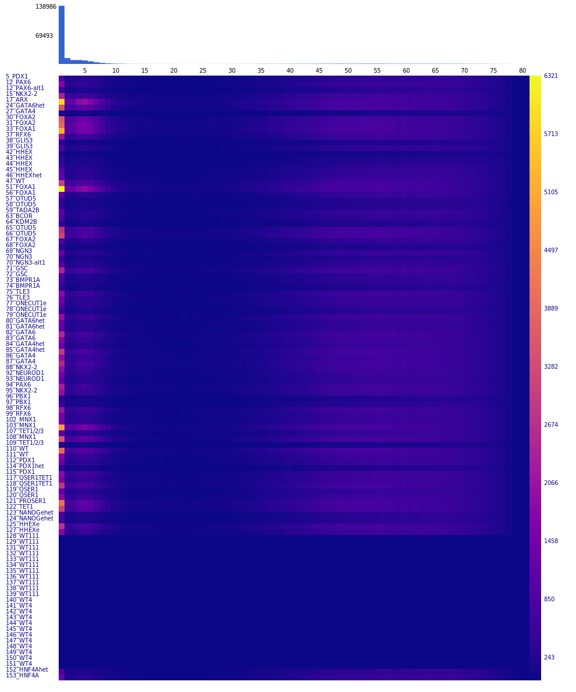

## Introduction

`assignBarcodes` is a fast, parallelized utility designed for targeted sequencing analysis in single-cell experiments. It efficiently assigns feature barcodes from FASTQ files to a known set of sequence barcodes, serving as a powerful, open-source alternative to proprietary tools.

Key features include:
- **Exhaustive Search:** Unlike other tools, `assignBarcodes` performs an exhaustive search, enabling it to identify feature barcodes in both ATAC-seq and RNA-seq data, significantly increasing coverage in targeted sequencing.
- **Advanced Error Correction:** Implements customizable error correction for sequence barcodes, handling substitutions and indels, inspired by methodologies used in tools like CellRanger.
- **Fuzzy Matching:** Provides fuzzy matching capabilities for feature sequences to account for sequencing errors.
- **UMI Deduplication:** Correctly handles UMI-based deduplication with strategies tailored for different sequencing assays (e.g., targeted vs. whole-transcriptome). It intelligently handles UMI sequencing errors by identifying and collapsing connected cliques of similar UMIs.
- **High Performance:** Achieves high processing speeds (e.g., ~1 million reads/second on a standard laptop for targeted sequencing) through multi-level parallelization.

## Quick start
### Installation

On Ubuntu/Debian:
```bash
sudo apt-get update
sudo apt-get -y install build-essential zlib1g-dev libglib2.0-dev libcairo2-dev
cd process_features
make
sudo cp assignBarcodes /usr/local/bin
```
If heatmap generation is not required, you can omit the `libcairo2-dev` dependency and compile using:
```bash
make NO_HEATMAP=1
```

#### Docker
Alternatively, you can use the Docker container `biodepot/process_features:latest` or build it from the provided Dockerfile.

## Usage

```bash
assignBarcodes [options] [directory1 directory2 ...]
```

The tool can accept input FASTQ files in two ways:
1.  **By directory:** Positional arguments specifying directories containing FASTQ files. The tool will search for files matching the patterns for barcode, forward, and reverse reads.
2.  **By file list:** Using `--barcode_fastqs`, `--forward_fastqs`, and `--reverse_fastqs` to provide comma-separated lists of files.

## Flags and Descriptions

### Input & Output Files

| Flag | Argument | Description | Default |
| :--- | :--- | :--- | :--- |
| `-w`, `--whitelist` | `[filename]` | Whitelist file for sequence barcodes. | (required) |
| `-f`, `--featurelist` | `[filename]` | Feature list file (CSV with 'name' and 'sequence' columns). | (required) |
| `-d`, `--directory` | `[path]` | Base output directory. A subdirectory will be created for each sample. | (required) |
| `--barcode_fastqs` | `[string]` | Comma-separated list of barcode FASTQ files. | |
| `--forward_fastqs` | `[string]` | Comma-separated list of forward read FASTQ files. | |
| `--reverse_fastqs` | `[string]` | Comma-separated list of reverse read FASTQ files. | |
| `--barcode_fastq_pattern` | `[string]` | Pattern to identify barcode FASTQ files in directories. | `_R1_` |
| `--forward_fastq_pattern` | `[string]` | Pattern to identify forward read FASTQ files. | `_R2_` |
| `--reverse_fastq_pattern` | `[string]` | Pattern to identify reverse read FASTQ files. | `_R3_` |
| `-k`, `--keep_existing` | | If output files exist, skip processing for that sample. | `false` |

### Barcode & Feature Processing

| Flag | Argument | Description | Default |
| :--- | :--- | :--- | :--- |
| `-b`, `--barcode_length`| `[int]` | Length of the sequence barcode. | `16` |
| `-u`, `--umi_length` | `[int]` | Length of the Unique Molecular Identifier (UMI). | `12` |
| `-o`, `--feature_constant_offset`| `[int]` | Expected starting position of the feature sequence in the read. Used for an initial directed search. | `0` |
| `-B`, `--barcode_constant_offset`| `[int]` | Starting position of the barcode and UMI in the read. | `0` |
| `--limit_search` | `[int]` | Limit the search for the feature sequence to `N` bases around `feature_constant_offset`. Set to `-1` to search the entire read. | `-1` |
| `-r`, `--reverse_complement_whitelist` | | Reverse complement the whitelist barcodes before use. | `false` |
| `-a`, `--as_named` | | Treat all input files as part of a single sample. | `false` |

### Error Correction & Thresholds

| Flag | Argument | Description | Default |
| :--- | :--- | :--- | :--- |
| `-m`, `--maxHammingDistance` | `[int]` | Maximum Hamming distance for a feature sequence to be considered a match. | `1` |
| `-s`, `--stringency` | `[int]` | Stringency for UMI deduplication. See [UMI de-duplication](#umi-de-duplication) section for details. | `1` |
| `-i`, `--min_counts` | `[int]` | Minimum read count for a UMI clique to be considered for counting. | `1` |
| `-M`, `--min_posterior` | `[float]` | Minimum posterior probability to rescue a barcode with sequencing errors. | `0.975` |
| `--max_barcode_mismatches` | `[int]` | Maximum number of mismatches allowed to rescue a sequence barcode. | `3` |
| `--feature_n` | `[int]` | Maximum number of 'N' bases allowed in a feature sequence. | `3` |
| `--barcode_n` | `[int]` | Maximum number of 'N' bases allowed in a sequence barcode. | `1` |
| `--max_reads` | `[long]` | Maximum number of reads to process from each FASTQ file. | `0` (all) |


### Performance & Parallelism

| Flag | Argument | Description | Default |
| :--- | :--- | :--- | :--- |
| `-t`, `--threads` | `[int]` | Maximum number of concurrent processes (samples to process in parallel). | `8` |
| `-T`, `--available_threads` | `[int]` | Total number of threads available to the program. `assignBarcodes` will attempt to optimally distribute them. | `8` |
| `-S`, `--search_threads` | `[int]` | Manually set the number of threads for the feature search step (per consumer thread). Overrides automatic allocation. | `4` |
| `-c`, `--consumer_threads_per_set`| `[int]` | Manually set the number of consumer threads per sample. Overrides automatic allocation. | `1` |
| `-P`, `--parallel_by_file` | | Use one producer thread per FASTQ file instead of one per set of files. Can be faster for many small files. | `false` |
| `-R`, `--read_buffer_lines` | `[int]` | Number of lines for the read buffer. | `1024` |
| `-L`, `--average_read_length` | `[int]` | Estimated average read length for buffer allocation. | `300` |

### Miscellaneous

| Flag | Argument | Description | Default |
| :--- | :--- | :--- | :--- |
| `-v`, `--debug` | | Enable verbose debug output. | `false` |


## Example Usage

```bash
./assignBarcodes \
    -d ./output_dir/ \
    -w /path/to/10x_whitelist.txt \
    -f /path/to/features.csv \
    -T 32 \
    -t 8 \
    -m 5 \
    -u 12 \
    -o 26 \
    --limit_search 5 \
    --barcode_fastq_pattern R1 \
    --forward_fastq_pattern R2 \
    /path/to/sample1_fastqs/ \
    /path/to/sample2_fastqs/
```
This command processes two samples located in separate directories. It uses 32 available threads, forking up to 8 sample-processing jobs at a time. It looks for feature sequences with up to 5 mismatches, starting at base 26 and searching 5 bases upstream and downstream.

## Search methodology
#### Initial fixed position search
For targeted sequencing, most of the of read sequences will have a constant start sequence of fixed length. `assignBarcodes` attempts to make a match here first. If no match is found, then it does a more expensive exhaustive search. The scope of this search can be controlled with the `--limit_search` flag.

#### Exhaustive search
The exhaustive search checks the entire read against all the feature barcodes at all possible starting positions in the read. For ATAC-seq the search is done in both orientations. We use a novel method that converts the query and match sequences to bitcodes. We uses bitwise ops and a lookup table for hamming distance evaluation of 4 basepairs chunks with a bitops and lookup and can be vectorized by the compiler for even greater speedup. Additionally, the search is broken down into four independent subsearches which are performed in parallel for a 16x speedup over the simple Hamming search.

## Error correction
### Sequence barcodes
The error correction handles Ns (unknown base pairs) and sequencing errors. To take into account sequencing errors, a barcode can be at most 1 base pair different from a single valid barcode and then it will be assigned to that barcode. If there are multiple barcodes, then we look at the quality scores and the number of barcodes variants observed and find the most likely match for the barcode based on the posterior probability. This is described in the Cell Ranger documentation.
To handle N's the user specifies a maximum number of Ns (`--barcode_n`) that are tolerated. All the possible base pairs are substituted for an N and then compared to see if a unique barcode is found.
### Feature barcodes
To handle sequencing errors, the user specifies a maximum Hamming distance (`-m`). If a sequence matches a feature barcode within the Hamming distance and uniquely to a sequence with a minimum distance then it is assigned to that feature barcode. For N's up to a maximum specified by the user (`--feature_n`), all possible variations are generated for the N's and checked against the possible sequences. If there is a unique best match (minimum Hamming distance) that is less or equal to the maximum Hamming distance then it is assigned to that feature barcode. Assignments are tentative, pending the completion of the comprehensive search (unless there is an exact match). If there is no exact match, the comprehensive search attempts to find a better match.

## UMI de-duplication

#### Introduction
Unique Molecular Identifiers are random sequences that are included with barcodes that are used to identify groups of reads that are duplications of the same sequence. De-duping counts using gives a more accurate reflection of the relative abundance of the originating sequences.
The de-duping algorithm depends on the methodology used.
In scRNA-seq and bulk RNA-seq, counts assigned to a sequence barcode-umi are collapsed only if they map to the same position. This is a relatively rare event that occurs only due to the large number of reads. For CRISPR-targeted sequencing, there is a much lower number of possible mappings and it is very common for a barcode-umi to map to multiple feature sequences and requires a more complicated strategy. `assignBarcodes` gathers counts all the sequences associated with a barcode-umi, and chooses a user option to handle how the counts should be de-duped.
#### Aggregation into connected components
Sequencing errors of UMIs can occur and single sequence errors in UMIs are much more likely than having two random UMIs that differ by 1 base pair. To account for this, `assignBarcodes` aggregates barcode-umi sets that differ by 1 base pair in the UMI (connected-component).

Once the connected component is formed. The counts are aggregated based on two variables, `stringency` and `minimum_counts` that are provided by the user using the `-s` and `-i` flags.

#### De-duping strategy options
- **`--stringency 0`**: RNA-seq strategy. Any feature with at least `--min_counts` gets a single deduped count for that UMI clique. This is the only case where a UMI clique can yield counts for multiple features.
- **`--stringency 1-999`**: Finds the feature with the highest count. If there is a unique winner, and its count is greater than `total_counts * (stringency / 1000)` and `total_counts > min_counts`, the feature gets a count of 1. Otherwise, no count is assigned.
- **`--stringency >=1000`**: The most stringent option. A count is assigned only if a single feature is detected within the UMI clique and its raw count is greater than `min_counts`.

### Parallelization

There are 3 levels of parallelization. The user can completely control the number of threads used in each parallelization process or can just assign the number of threads (`-T`) and allow `assignBarcodes` to apportion them out optimally. The different levels of parallelization used are:
1.  **A producer-consumer model** that allows the reading of fastq files to take place simultaneously with the processing.
2. **Parallelization of the hamming search** for features within reads.
3. **Forking off separate processes** for multiple samples.

#### Fastq input and processing
This is done using pthreads. The default strategy is to have one thread read the barcode file, the forward file and if it exists the reverse read file. The user also has the option to use a thread for each fastq file (`-P`). Though this has more overhead, it can be faster when there is are only a few samples that are split into many files and/or there are many processors available with a fast SSD. One or more consumer threads pull reads from the buffer and processes them while the fastq reader(s) populate them from the files.

#### Hamming search parallelization
The search function proceeds using 4 independent search frames. OpenMP is used to assign up to 4 threads to parallelize and increase the search speed. The number of threads can be controlled with `-S`.

#### Forking off separate processes
To handle multiple samples, `assignBarcodes` can fork off a separate process for each. The maximum number of concurrent processes is controlled by `-t`. This is considerably faster than using OpenMP with little extra overhead as the memory footprint is very small (often less than 1GB per process - closer to 100 MB for ATAC and scRNA-seq files as most of their reads do not have feature barcodes).

### Feature and sequence file formats

**Sequence barcodes** (`--whitelist`) are provided one barcode per line. Standard sequence barcode whitelists from 10x work fine.

**Feature barcodes** (`--featurelist`) should be provided as comma separated files with a header line. The header line must contain a 'sequence' field and a 'name' field. The other fields are ignored.

### Output format
The assignments are outputted in matrix market format which essentially has 3 files listing the barcodes, features and count matrix.

### QC files
#### Run stats
In the output directory for each sample, `stats.txt` contains run statistics.
```
Total feature counts 31993392
Total deduped feature counts 6765455
Total unique barcode UMIs 9148050
Total whitelisted barcodes 259694
Total_unmatched_reads 7236844
Percentage reads assigned to barcode 81.5529
```
#### Matched sequences
Each assigned feature sequence is listed in the `feature_sequences.txt` file.
```
Feature Index Sequence Hamming_distance Counts Feature_name
  1 CAACTGCGTCCATGAAACAATAGACGCAGTTGAGAGTGGC  0      11 5_PDX1
  2 GGTATGTGAACATACAACATAGGAGTTGGTTACAAGGAAT  0      32 12_PAX6
  2 GGTATGTGAACATACAACATAGaAGTTGGTTACAAGGAAT  1       1 12_PAX6
...
```
Each of the matched sequences is displayed under the feature index that they are matched to. Mismatches relative to the reference feature are shown in lowercase.

#### Feature frequency histogram heatmap
After deduplication, a histogram of the number of features assigned to each cell barcode is generated. This can be visualized in `heatmap.png`. The perfect scenario would be nearly all cells have 1 feature assigned to them, with a small distribution representing multiplets and another small distribution from empty cells. Underneath is a heatmap where each row is the same histogram, but only showing cells that have that feature in it. The values of the histograms are space separated in `feature_histograms.txt`. There is also another file with the coexpression matrix, i.e. how many times feature i is seen with feature j. This is in `feature_coexpression.txt`.

###### Heatmap example


## Repository Organization

The repository is organized into the following main directories:

-   **`src/`**: Contains all the C source code files.
    -   `main.c`: The main entry point of the application, handles command-line argument parsing and orchestrates the overall workflow.
    -   `assignBarcodes.c`: Core logic for barcode assignment, error correction, and feature matching.
    -   `io.c`: Functions related to reading FASTQ files and handling input.
    -   `memory.c`: Memory management utilities, including memory pools for efficient allocation.
    -   `queue.c`: Implementation of a queue data structure used for parallel processing.
    -   `utils.c`: Helper functions used across the application.
    -   `globals.c`: Definitions of global variables.
    -   `heatmap.c`: Functions for generating the QC heatmap image.
-   **`include/`**: Contains all the header files.
    -   `prototypes.h`: Function prototypes for functions defined in the `src` directory.
    -   `common.h`: Common headers, structs, and macros used throughout the project.
    -   `...`: Other header files defining specific data structures and constants.
-   **`scripts/`**: Contains utility scripts for testing and other purposes.
-   **`graphics/`**: Contains image files used in the documentation.
-   **`Makefile`**: The main makefile for compiling the project.
-   **`Dockerfile`**: For building the Docker container. 